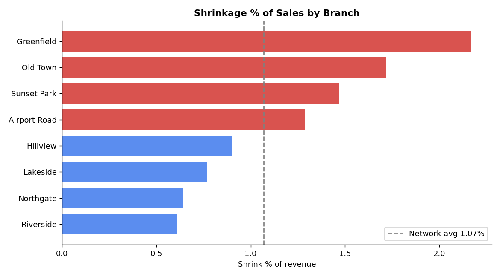
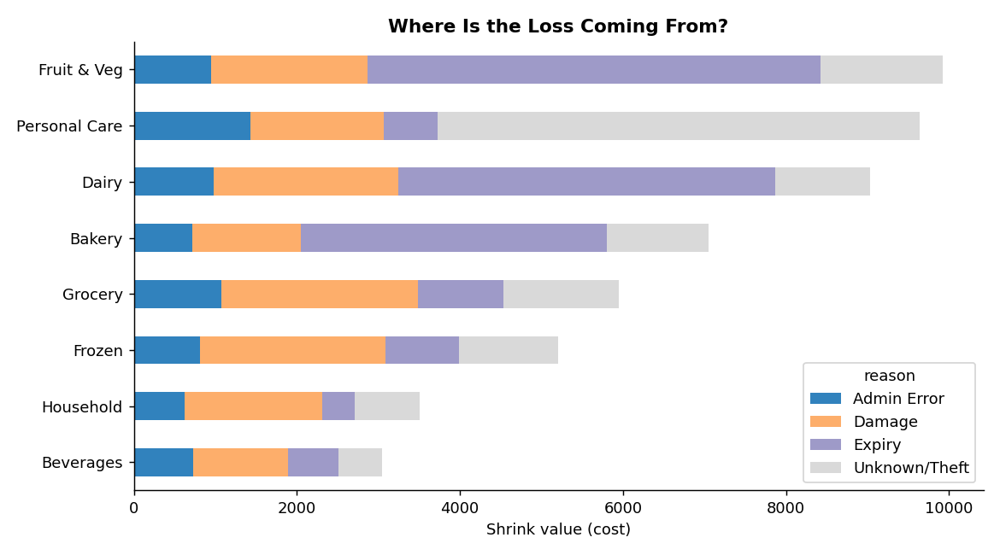
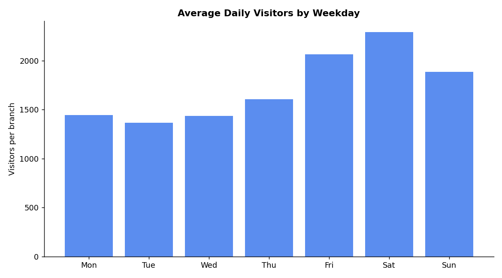
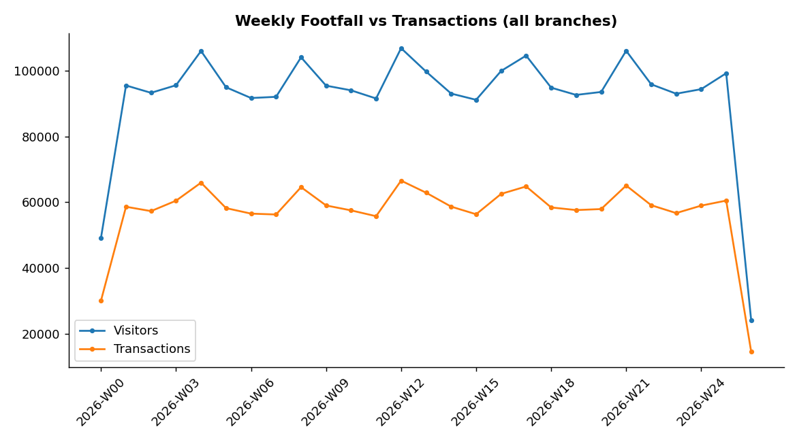
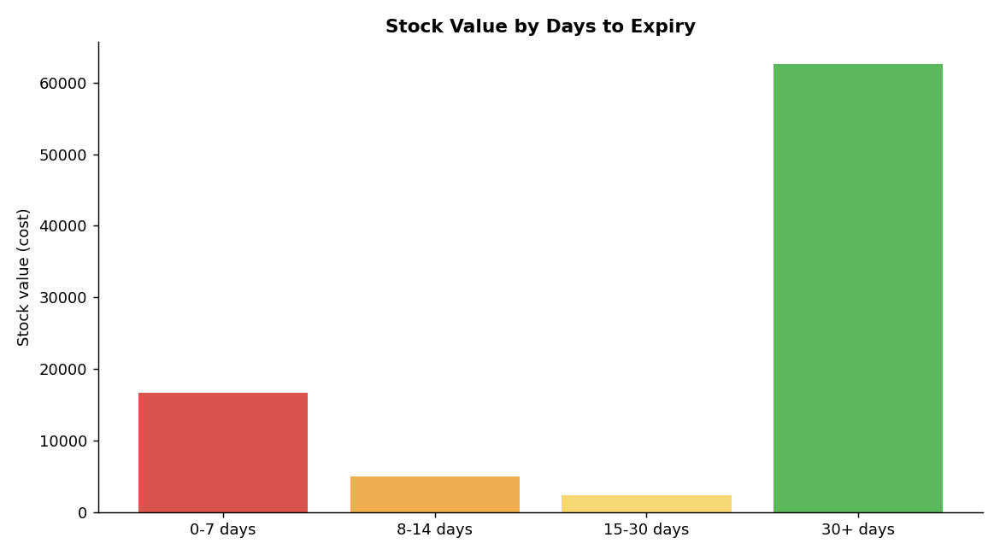

# Retail Analytics Summary

_Generated from synthetic data by `analysis/run_analysis.py`._

## Shrinkage
- Network shrink is **1.07%** of sales.
- Highest-shrink branch: **Greenfield** at **2.17%** (2.0x the network average).
- Category losing the most value: **Fruit & Veg**.
- Biggest loss reason overall: **Expiry** (33% of shrink value).

## Footfall & Conversion
- Busiest day: **Sat**; quietest day: **Tue**.
- Best conversion: **Greenfield** at **62.5%**.

## Short-Expiry Risk (next 30 days)
- **100** batches are projected to have unsold stock at expiry.
- Estimated value at risk: **3,270.92** (at cost).

Top 5 batches to act on (markdown, transfer or promote):

| branch_name   | product_name   |   days_left |   qty_on_hand |   projected_unsold |   value_at_risk |
|:--------------|:---------------|------------:|--------------:|-------------------:|----------------:|
| Riverside     | Bakery Item 01 |           1 |           118 |                 82 |          215.68 |
| Northgate     | Bakery Item 01 |           2 |           108 |                 54 |          143.35 |
| Riverside     | Dairy Item 03  |           1 |            61 |                 30 |          140.32 |
| Old Town      | Dairy Item 03  |           2 |            68 |                 29 |          136.39 |
| Greenfield    | Dairy Item 01  |           1 |            42 |                 31 |          122.77 |

